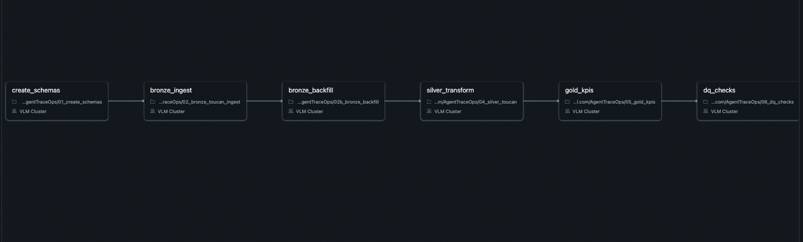
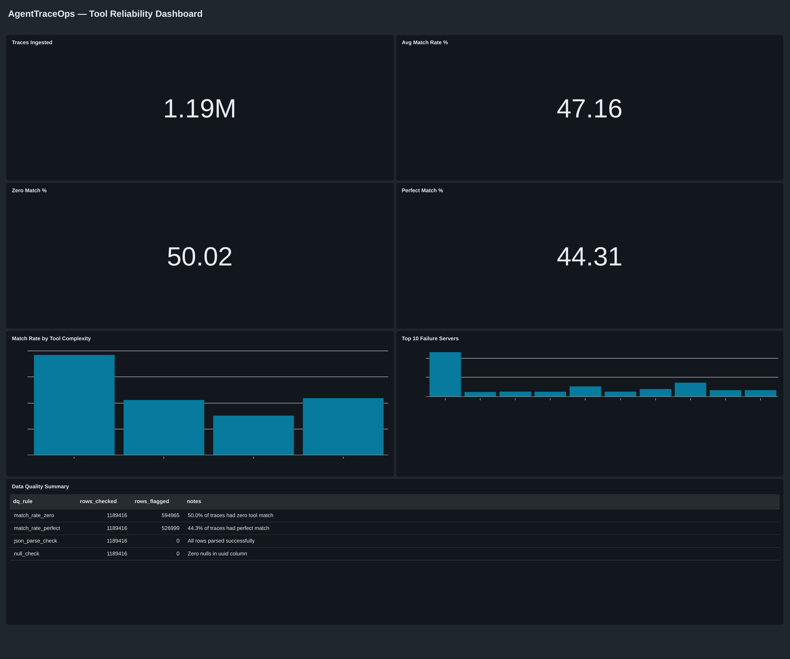

# AgentTraceOps

A Databricks lakehouse pipeline that ingests 1.19M AI agent traces from three models, parses tool-call behavior across two different message formats, and answers one question: **when agents have access to the right tools, do they actually use them?**

The answer: **less than half the time — and all three models fail at nearly the same rate.**

## What I Found

I analyzed 1,189,416 agent execution traces from the Toucan-1.5M dataset across three models (SFT, Kimi-K2, Qwen3), supplemented by 148 annotated traces from the TRAIL benchmark. Each trace records a user question, the tools an agent had available, the tools it was expected to use, and the full conversation of what it actually did.

**Finding 1 — All three models perform nearly identically.** SFT: 47.9% match rate. Kimi-K2: 47.0%. Qwen3: 47.2%. Despite different architectures and training approaches, they all get tool selection right less than half the time. This suggests the bottleneck is in the task or tool design, not the model.

**Finding 2 — Agents either nail it or completely miss.** Roughly half of traces achieve perfect tool matches. The other half achieve zero matches. Less than 1% fall in between. Agents don't partially fail — they fail entirely.

**Finding 3 — Single-tool tasks are nearly flawless. Multi-tool tasks break down.** When an agent only needs one tool, it picks the right one 99.9% of the time. The moment it needs two or more tools, accuracy drops to 25–33%. The failure mode isn't "picking bad tools" — it's coordinating across multiple tools.

**Finding 4 — Certain MCP servers are disproportionately associated with failures.** The dictionary server alone accounted for ~40K+ failed tool calls. Weather-related servers collectively represent the largest failure cluster. These point to specific tool schemas or descriptions that confuse agents.

**Finding 5 — First impressions lie.** My initial 39K-row sample showed a 78.5% match rate. After scaling to 1.19M rows, the real rate was 47%. The first shard was unrepresentatively clean.

**Finding 6 — Different models use different message formats.** SFT traces use `tool_call` and `tool_response` roles. Kimi-K2 and Qwen3 use `assistant` messages with a `function_call` field and `function` role for responses. Discovering and handling this required parsing each format separately — a real-world data integration challenge.

**Finding 7 — UUIDs are shared across models.** The same question (same UUID) was given to all three models. Using UUID alone as a primary key caused 127K duplicate collisions at scale. The true unique key is `(uuid, model_name)` — discovered only after scaling from 119K to 1.19M rows.

## How the Pipeline Works

Raw parquet files from Hugging Face and gated datasets from PatronusAI go through three layers before becoming dashboard-ready metrics.

**Bronze** stores raw data exactly as it arrived — 1,189,416 Toucan rows across 83 parquet shards from three model subsets, plus 148 TRAIL annotation rows from two benchmark sources (GAIA and SWE-Bench). Each shard is tagged with a unique source label, ingestion timestamp, and run ID. The ingestion is idempotent: running a notebook twice doesn't create duplicates because it checks if each shard's source label already exists before writing.

**Silver** parses the nested JSON in each trace. This required handling two distinct message formats: SFT traces store tool calls in a `tool_call` role with the tool name in the content field, while Kimi-K2 and Qwen3 traces store tool calls as `assistant` messages with a `function_call` object. The parser detects and extracts from both formats. A key challenge: actual tool names include an MCP server prefix (`lyrical-mcp-find_rhymes`) while target tools use short names (`find_rhymes`). I used `endsWith` matching to bridge this gap. Silver processing is incremental — it tracks which `(uuid, model_name)` pairs are already processed and only transforms new Bronze rows.

**Gold** aggregates Silver into four tables: headline KPIs, match rates bucketed by tool complexity, failure patterns grouped by MCP server, and dynamically computed data quality metrics.

The full pipeline is orchestrated as a Databricks Workflow with six tasks running in sequence:

```
create_schemas → bronze_ingest → bronze_backfill → silver_transform → gold_kpis → dq_checks
```



## What the Dashboard Shows

Four KPI tiles at the top: traces ingested (1.19M), average match rate (~47%), zero match rate (~52%), and perfect match rate (~48%).

Below that, two charts. The first shows match rate by tool complexity — a steep cliff from single-tool (near 100%) to multi-tool (~25-33%). The second shows the top 10 MCP servers associated with failed traces, with dictionary and weather servers dominating.

At the bottom, a data quality summary table showing all checks passing across 1.19M rows.



## Engineering Decisions

**Why idempotent ingestion?** Each parquet shard gets a unique `source` label (e.g., `toucan_sft_0001`). Before writing, the notebook checks if that label already exists in Bronze. This means the pipeline is safe to rerun — it won't duplicate data. Proven when cluster restarts required rerunning notebooks mid-pipeline.

**Why schema enforcement?** Bronze reads data with an explicitly defined `StructType` rather than letting Spark infer the schema. If a future shard has different columns, the pipeline fails immediately instead of silently loading mismatched data.

**Why incremental Silver?** Silver uses a `LEFT ANTI JOIN` on the composite key `(uuid, model_name)` to skip rows that are already processed. When new shards are added to Bronze, only the delta flows through Silver — no full reprocessing.

**Why a composite key?** UUID alone is not unique — the same questions were given to all three models. This was discovered when scaling from 119K to 1.19M rows caused 127K duplicate collisions. The true unique key is `(uuid, model_name)`, where `model_name` is derived from the `source` column at ingestion time.

**Why multi-format parsing?** SFT, Kimi-K2, and Qwen3 use different message schemas. Rather than forcing a single parser, Silver detects which format each trace uses (by checking for `function_call` fields vs `tool_call` roles) and extracts tool names from the correct location. This turned a 0% match rate for Kimi-K2/Qwen3 into the real ~47%.

**Why quarantine?** Records that fail JSON parsing get routed to a separate quarantine table instead of being silently dropped. In this dataset zero rows were quarantined, but the mechanism exists for when messier data arrives.

**Why 11 DQ checks?** Automated validation runs across all three layers: null keys, empty messages, composite key uniqueness, match rate ranges, row count reconciliation between layers, and Gold KPI alignment. All 11 pass.

**Why alerting?** A Databricks SQL Alert monitors the zero-match rate and sends email notifications when it exceeds 50%. This provides agentic notification of data quality degradation without manual monitoring.

## Tables

```
bootcamp_students.vadlamani_bronze
  ├── toucan_raw            1,189,416 rows    Raw traces from 3 models + ingestion metadata
  └── trail_raw                   148 rows    Annotated traces from TRAIL benchmark

bootcamp_students.vadlamani_silver
  └── toucan_trace          1,189,416 rows    Parsed traces with match rates + model_name

bootcamp_students.vadlamani_gold
  ├── trace_kpis                1 row         Headline operational metrics
  ├── match_by_complexity       4 rows        Match rate by tool count bucket
  ├── failure_patterns        50+ rows        Failed calls grouped by MCP server
  └── dq_metrics                4 rows        Data quality check results
```

## Notebooks

```
AgentTraceOps/
  01_create_schemas.py              Creates bronze/silver/gold schemas (run once)
  02_bronze_toucan_ingest.py        Downloads SFT shard 0000 → Bronze (idempotent)
  02b_bronze_backfill.py            Downloads SFT shards 0001-0002 → Bronze (idempotent)
  02d_bronze_toucan_scale.py        Downloads Kimi-K2 + Qwen3 subsets → Bronze (idempotent)
  02e_bronze_trail_ingest.py        Downloads TRAIL benchmark → Bronze (idempotent, gated)
  03_explore_bronze.py              Data profiling and exploration
  04_silver_toucan.py               Multi-format parsing, match rates (incremental)
  05_gold_kpis.py                   Aggregates into KPI, complexity, failure, DQ tables
  06_dq_checks.py                   11 automated checks across all layers
```

## Data Sources

**Toucan-1.5M** — [Agent-Ark/Toucan-1.5M](https://huggingface.co/datasets/Agent-Ark/Toucan-1.5M). 1,189,416 trajectories from the SFT (119K), Kimi-K2 (519K), and Qwen3 (552K) subsets. Each trace contains a user question, available tools, target tools, and full agent conversation. Apache 2.0 license.

**TRAIL** — [PatronusAI/TRAIL](https://huggingface.co/datasets/PatronusAI/TRAIL). 148 annotated agent execution traces with 841 labeled errors across reasoning, execution, and planning categories. Built from GAIA (118 traces) and SWE-Bench (30 traces). MIT license, gated access.

## Workarounds I Ran Into

**Hugging Face datasets library breaks on Databricks Runtime 18.1.** The `load_dataset()` function throws a `maxdepth` error due to a conflict with Databricks' patched `huggingface_hub`. Fix: bypass the library entirely and read parquet files directly from Hugging Face URLs.

**Spark can't read from local `/tmp/` on Databricks.** Downloaded files land on the driver's local disk, but Spark expects DBFS paths. Fix: `dbutils.fs.cp("file:/tmp/file.parquet", "dbfs:/tmp/file.parquet")` to copy to DBFS before reading.

**Tool name prefix mismatch tanks match rates to 0%.** Actual tool call names include the MCP server as a prefix (`lyrical-mcp-find_rhymes`) but target tools are just the short name (`find_rhymes`). `array_intersect` returns zero matches. Fix: use `endsWith()` matching.

**Different models use different message schemas.** SFT uses `role: "tool_call"` while Kimi-K2/Qwen3 use `role: "assistant"` with a `function_call` object. Initial Silver parser only handled SFT format, showing 0% match rate for the other two models. Fix: extended the JSON schema to include `function_call` and `name` fields, then extract tool names from whichever format is present.

**UUID is not unique across subsets.** The same question UUID appears in SFT, Kimi-K2, and Qwen3 because all three models answered the same questions. Using UUID alone as a dedup key caused Silver to skip ~1M rows. Fix: derive `model_name` from the `source` column and use `(uuid, model_name)` as the composite key.

## If This Were Production

Things I'd add with more time: Delta MERGE for true upsert logic instead of append-based incremental loading. Table partitioning by `model_name` for query performance at scale. Delta Live Tables with built-in expectations for declarative DQ. Streaming ingestion via Auto Loader for real-time trace processing. TRAIL Silver/Gold transforms for error categorization and failure taxonomy enrichment. Slack webhook integration for real-time alert delivery. Loading the remaining Toucan OSS subset to reach the full 1.6M+ rows.

## Stack

Databricks · Unity Catalog · Delta Lake · PySpark · Databricks Workflows · Databricks SQL Alerts · Databricks AI/BI Dashboard
